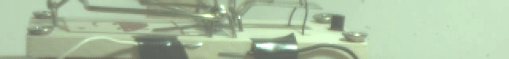

# imx708_regs_annotated
Reverse engineered annotated registers from Sony imx708 camera sensor, which is used in Raspberry Pi camera module 3 (v3). There is no leaked datasheet for imx708 yet. This is work in progress ...

## introduction

Leaked datasheets for the other Raspberry Pi camera sensors:  
ov5647 (v1) [datasheet](https://cdn.sparkfun.com/datasheets/Dev/RaspberryPi/ov5647_full.pdf)  
imx219 (v2) [datasheet](https://github.com/rellimmot/Sony-IMX219-Raspberry-Pi-V2-CMOS/blob/bb4a45eaad8b433c2f29aaa9c06592b4efd7552f/RASPBERRY%20PI%20CAMERA%20V2%20DATASHEET%20IMX219PQH5_7.0.0_Datasheet_XXX.PDF)  
imx477 (HQ) [datasheet](https://www.uctronics.com/download/Image_Sensor/IMX477-DS.pdf)  

Capturing i2c traffic with ftrace is described in this thread:  
[https://forums.raspberrypi.com/viewtopic.php?t=345763](https://forums.raspberrypi.com/viewtopic.php?t=345763)  

imx708 kernel driver can be found here:  
[https://github.com/raspberrypi/linux/blob/rpi-5.15.y/drivers/media/i2c/imx708.c](https://github.com/raspberrypi/linux/blob/rpi-5.15.y/drivers/media/i2c/imx708.c)  

Thread "high framerate libcamera video capturing" is on removing libcamera stack framerate limits of 90/120/120/200fps for v1/v2/HQ/v3 cameras:  
[https://forums.raspberrypi.com/viewtopic.php?t=345883](https://forums.raspberrypi.com/viewtopic.php?t=345883)  

It is known from raspiraw work, that v2 camera can capture 640x75@1007fps (the deal is reduced frame height for higher framerates). This is closing classsical mouse trap, the mouse trap bar closes in 0.01s:  


From work with v3 camera sofar, capturing 1024x96@1000fps should be possible with imx708 sensor. That is the motivation for this annotated register document.  

## registers

Annotations like eg. "X_ADD_STA_A" are taken from imx219 datasheet.  

Decoded values in 3 columns below are for these modes from kernel driver:  
- imx708_reg mode_2x2binned_720p_regs (1536x864)  
- imx708_reg mode_2x2binned_regs (2304x1296)  
- imx708_reg mode_4608x2592_regs (4608x2592)  

i2c captures were taken for this command, with MODE being 1536:864, 2304:1296 or 4608:2592:  
```
libcamera-vid --level 4.2 --mode MODE --framerate 5 --width 1536 --height 864 --save-pts t.pts -o t.h264 -t 1 --denoise cdn_off
```

Left top corner for 1st mode is (768,432), for the other modes it is (0,0).  
2nd and 3rd mode use full sensor area, 1st mode uses:  
```
(768..3839) x (432..2159)
```
(3839-768+1) = 2\*1536, (2159-432+1) = 2\*864, because that mode does 2x2binning.  


### [0x0100-0x01ff]  
```
 i2c_write: i2c-10 #0 a=01a f=0000 l=3 [01-00-01]  start streaming
 i2c_write: i2c-10 #0 a=01a f=0000 l=3 [01-00-00]  stop streaming
```


### [0x0200-0x02ff]  
```
 i2c_write: i2c-10 #0 a=01a f=0000 l=3 [02-02-04] 1158 1288  2601  ??
 i2c_write: i2c-10 #0 a=01a f=0000 l=3 [02-03-86]
```

### [0x0300-0x03ff]  
```
 i2c_write: i2c-10 #0 a=01a f=0000 l=3 [03-40-04] 1206 1336  2649  ??
 i2c_write: i2c-10 #0 a=01a f=0000 l=3 [03-41-b6]
 i2c_write: i2c-10 #0 a=01a f=0000 l=3 [03-42-14] 5216 7824 15648  ??
 i2c_write: i2c-10 #0 a=01a f=0000 l=3 [03-43-60]
 i2c_write: i2c-10 #0 a=01a f=0000 l=3 [03-44-03]  768    0     0  X_ADD_STA_A
 i2c_write: i2c-10 #0 a=01a f=0000 l=3 [03-45-00]
 i2c_write: i2c-10 #0 a=01a f=0000 l=3 [03-46-01]  432    0     0  Y_ADD_STA_A
 i2c_write: i2c-10 #0 a=01a f=0000 l=3 [03-47-b0]
 i2c_write: i2c-10 #0 a=01a f=0000 l=3 [03-48-0e] 3839 4607  4607  X_ADD_END_A
 i2c_write: i2c-10 #0 a=01a f=0000 l=3 [03-49-ff]
 i2c_write: i2c-10 #0 a=01a f=0000 l=3 [03-4a-08] 2159 2591  2591  Y_ADD_END_A
 i2c_write: i2c-10 #0 a=01a f=0000 l=3 [03-4b-6f]
 i2c_write: i2c-10 #0 a=01a f=0000 l=3 [03-4c-06] 1536 2304  4608  x_output_size
 i2c_write: i2c-10 #0 a=01a f=0000 l=3 [03-4d-00]
 i2c_write: i2c-10 #0 a=01a f=0000 l=3 [03-4e-03]  864 1296  2592  y_output_size
 i2c_write: i2c-10 #0 a=01a f=0000 l=3 [03-4f-60]
```

### [0x0400-0x04ff]  
```
 i2c_write: i2c-10 #0 a=01a f=0000 l=3 [04-0c-06] 1536 2304  4608  x_output_size (dup)
 i2c_write: i2c-10 #0 a=01a f=0000 l=3 [04-0d-00]
 i2c_write: i2c-10 #0 a=01a f=0000 l=3 [04-0e-03]  864 1296  2592  y_output_size (dup)
 i2c_write: i2c-10 #0 a=01a f=0000 l=3 [04-0f-60]
```
